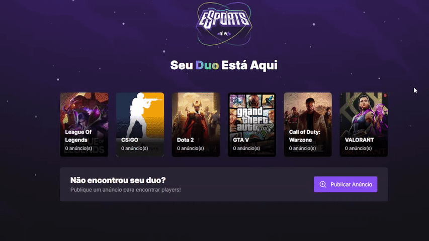

<h1 align="center">
    NLW-eSports
</h1>
<h3 align="center"> 
  🚧  Em Andamento ...  🚧
</h3>

<p align="center">
  <a href="#-pré-requisitos">Pré-Requisitos</a>&nbsp;&nbsp;&nbsp;|&nbsp;&nbsp;&nbsp;
  <a href="#-bibliotecas-usadas">Tecnologias</a>&nbsp;&nbsp;&nbsp;|&nbsp;&nbsp;&nbsp;
  <a href="#-project">Read in English</a>
</p>

## 🧑‍💻 Projeto 

  No NLW eSports estamos desenvolvendo uma plataforma web e mobile onde Gamers podem encontrar parceiros para seus jogos favoritos.
  O projeto foi desenvolvido ultilizando React(ViteJS) com TypeScript e React Native com Expo, SQLite e Tailwind UI CSS.

  Na aplicação WEB, é possível criar anúncios para encontrar parceiros (ou duos). Já na aplicação mobile, 
  é possível acessar esses anúncios e visualizar as informações de cada jogador,
  além de ser possível copiar para a área de transferência o nome de usuário do Discord do jogador para adicioná-lo a sua lista de amigos.


  
 ### ✅ Demonstração (Web) 💻
<p align="center">
   
</p>

 ### ✅ Demonstração (Mobile) 📲
<p align="center">
   
</p>


### ⚙ Pré-requisitos

Antes de começar, você vai precisar ter instalado em sua máquina as seguintes ferramentas:
[Git](https://git-scm.com), [Node.js](https://nodejs.org/en/),[Expo](https://docs.expo.dev/) e/ou [Yarn](https://yarnpkg.com/).
Além disto é bom ter um editor para trabalhar com o código como [VSCode](https://code.visualstudio.com/).


### 📗 Rodando a Aplicação (web e mobile)

```bash
📗 Installation

# Clone este repositório
$ git clone https://github.com/HugoNunes87/nlw-esports-ignite.git

Web
1. $ cd web
2. $ npm install 
  or $ yarn install
3. $ npm run dev 
 or $ yarn run dev

Server
1. $ cd server
2. $ npm install 
  or $ yarn install
3. $ npm run dev

mobile
1. $ cd mobile
2. $ npm install 
  or $ yarn install
3. $ npx expo start 
```

## 🚀 Bibliotecas usadas

### Front-end 
* React
* ReactNative
* Expo
* TypeScript
* Taiilwind UI CSS
* Radix UI
* VITE

### Back-end
* express
* SQLite
* Axios
* Cors

<hr/>

## 🧑‍💻 Project

   At NLW eSports we are developing a web and mobile platform where Gamers can find partners for their favorite games.
   The project was developed using React(ViteJS) with TypeScript and React Native with Expo, SQLite and Tailwind UI CSS.

   In the WEB application, it is possible to create advertisements to find partners (or duos). In the MOBILE application,
   it is possible to access these advertisements and view the information of each player,
   and you can copy the player's Discord username to the clipboard to add them to your friends list.


<hr/>

Feito Por [Hugo Nunes](https://www.linkedin.com/in/hugo-nunes-323a41164/).
